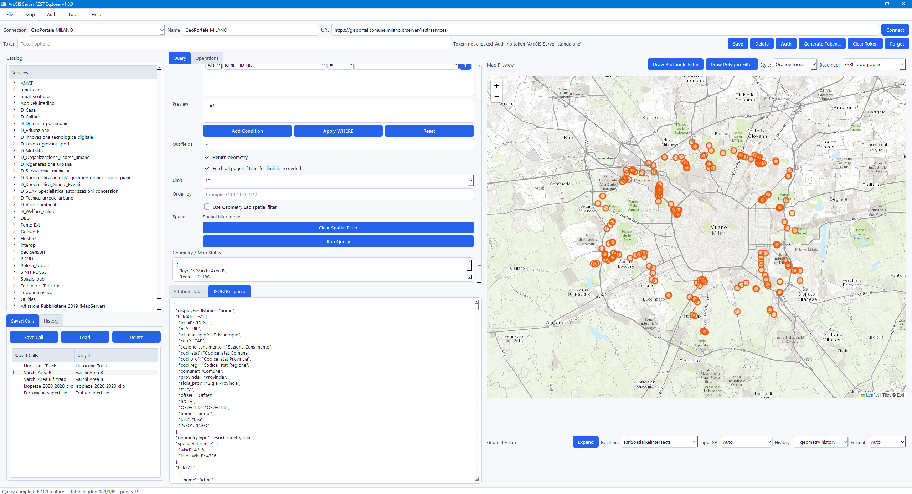
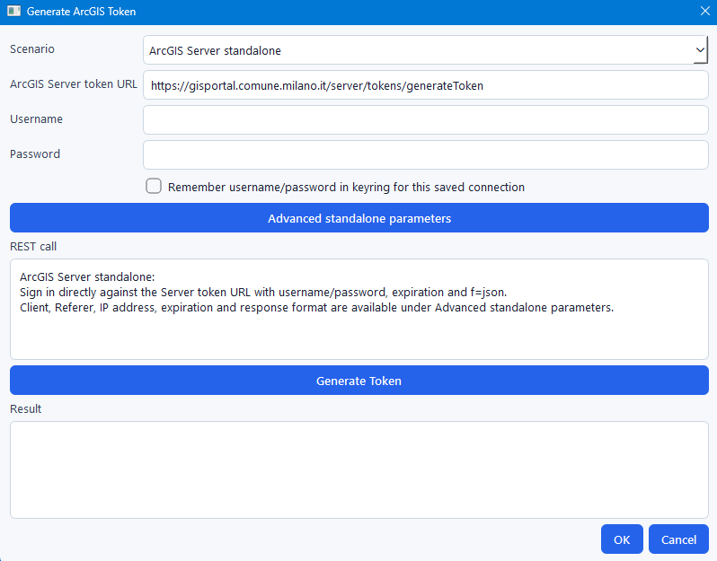
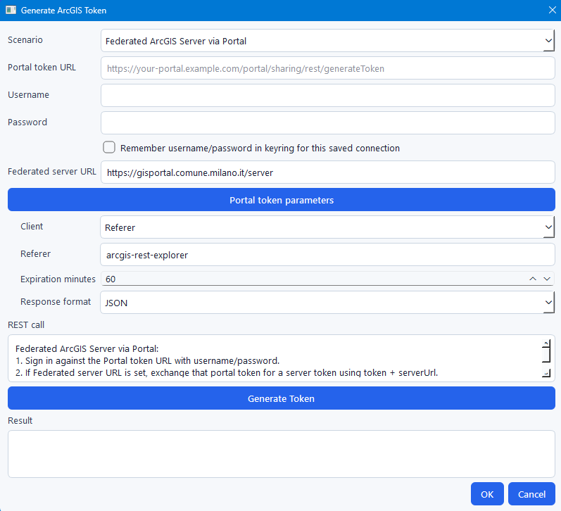

# ArcGIS Server REST Explorer

Desktop ArcGIS Server REST service explorer built with PySide6.

It lets you browse ArcGIS Server and Portal/federated REST services, inspect layer metadata, build queries, preview features on a Leaflet map, use spatial filters, and export responses/results.

## Screenshots



Screenshots may show public ArcGIS REST services from Comune di Milano / Geoportale Milano.
Data and service URLs are used only as public examples. Comune di Milano data is attributed to Comune di Milano / Portale del Dato, under the applicable open-data license unless otherwise stated by the source.

This project is not affiliated with or endorsed by Comune di Milano. Basemap attribution is shown in the map screenshots where applicable.

## Highlights

- Browse ArcGIS REST service catalogs, folders, services, layers, and tables.
- Layer metadata summary in the main UI and full metadata from the catalog context menu.
- Visual query builder with row-based conditions, `AND/OR` joins, live SQL preview, and manual `WHERE` override.
- Operations tab for read-only layer operations and GPServer task execution.
- GPServer async `submitJob` support with job status polling.
- `outSR=4326` is requested when geometry is returned, so map rendering is more reliable.
- `Fetch all pages` supports ArcGIS pagination and uses a limited parallel fetch pool.
- Result table with context-menu export to CSV or XLSX.
- JSON response context menu for saving the payload as `.json`.
- Leaflet map preview with basemap selection and selectable feature style presets.
- Draw a rectangle or free-form polygon directly on the map and use it as a spatial filter.
- Geometry Lab for WKT, GeoJSON, and ArcGIS JSON conversion, validation, preview, import/export/copy, history, input SR, and spatial relation selection.
- Light and dark themes.
- Toast notifications when queries and exports complete.
- Local settings saved in `setting.json`.

## Authentication Model

Authentication is configured per saved connection.

Supported connection auth modes:

- `Manual / no token generation`
- `ArcGIS Server standalone`
- `Portal / federated ArcGIS Server`

Standalone ArcGIS Server token generation:



Portal/federated ArcGIS Server token generation:



Each connection can store its own non-secret auth settings:

- auth mode
- token endpoint
- referer
- expiration minutes

Tokens are not written to `connections.json`. When available, tokens are stored with `keyring`; otherwise they remain session-only. The UI exposes auth state, session clear, and saved-token forget actions.

Sensitive URL parameters are redacted from copied/saved diagnostic URLs, including `token`, `access_token`, `apikey`, `api_key`, `key`, and `bearer`.

## Local Data

Installed builds write local application data to:

```text
%APPDATA%\ArcGISRestExplorer
```

Files include:

- `connections.json`
- `collections.json`
- `history.json`
- `geometry_history.json`
- `setting.json`
- `arcgis_rest_explorer.log`

To override the data directory:

```powershell
set ARCGIS_REST_EXPLORER_HOME=C:\path\to\data
arcgis-rest-explorer
```

When running from the old source layout, existing root-level JSON files are migrated automatically if the new data directory is empty.

## Install From Wheel

Build and install:

```powershell
python -m pip install build
python -m build
pip install dist\arcgis_rest_explorer-0.82.0-py3-none-any.whl
arcgis-rest-explorer
```

The wheel exposes this console script:

```text
arcgis-rest-explorer
```

You can also run the package module:

```powershell
python -m arcgis_rest_explorer
```

## Run From Source

```powershell
python -m venv .venv
.venv\Scripts\activate
pip install -r requirements.txt
python main.py
```

The root `main.py` is a compatibility wrapper around:

```text
arcgis_rest_explorer.app:main
```

## Development

Install runtime and test dependencies:

```powershell
pip install -r requirements.txt
```

Run tests:

```powershell
python -m pytest
```

Build the package:

```powershell
python -m build
```

Expected output:

```text
dist/arcgis_rest_explorer-0.82.0-py3-none-any.whl
dist/arcgis_rest_explorer-0.82.0.tar.gz
```

## Package Layout

```text
arcgis_rest_explorer/
  app.py              # PySide6 application and main window
  dialogs.py          # token, connection auth, and Geometry Lab dialogs
  arcgis_geometry.py  # geometry parsing/conversion helpers
  credentials.py      # keyring integration
  map_html.py         # Leaflet HTML template
  query_utils.py      # ArcGIS query parameter helpers
  storage.py          # JSON load/write helpers
  __main__.py         # python -m arcgis_rest_explorer
```

## Quick Geometry Lab Test

1. Start the app.
2. Expand `Geometry Lab`.
3. Click `Sample Polygon`.
4. Click `Preview`.
5. Click `Use In Query` to enable it as a spatial filter.

## Test Service URL

```text
https://sampleserver6.arcgisonline.com/arcgis/rest/services
```

## Notes

- Leaflet assets are currently loaded from CDN in the embedded map view.
- XLSX export uses a lightweight built-in writer and does not require `openpyxl`.
- JSON writes are atomic and corrupt local JSON files are backed up before being replaced.

## Disclaimer

The software is distributed on an "AS IS" BASIS, WITHOUT WARRANTIES OR CONDITIONS OF ANY KIND, either express or implied.
